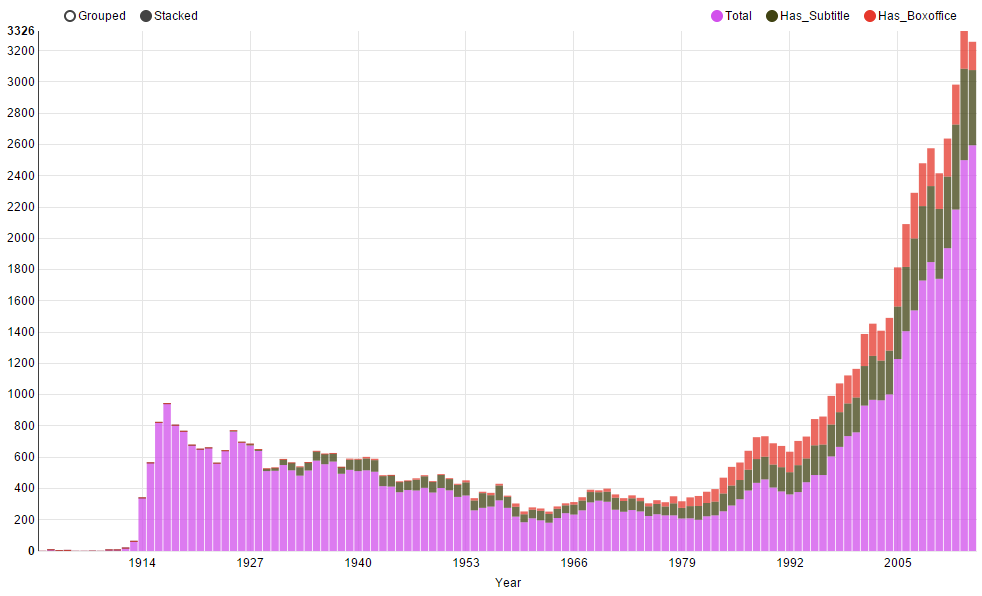
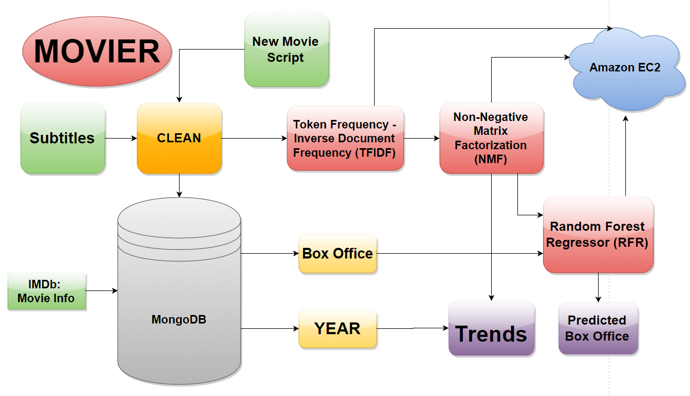

## [Movier](movier.space) - Wei Chen's Capstone Project

### Overview

Movier is a data science project (Natural Language Processing, [NLP](en.wikipedia.org/wiki))
on [TOPIC MODELING](en.wikipedia.org/wiki/Topic_model) and TREND ANALYSIS for US feature movies from year 1914 to year 2014 based on their English subtitles / scripts. It also explores how predictive the extracted topics can be to the box office. It is running on an Amazon EC2 instance [movier.space](movier.space). The Github repo can be found [here](github.com/weichen1984/Movier). 

### Motivation

Movie is an industry of art where romance meets economics.

Directors want to make movies with artistic values, producers want to produce movies with business values, while audience want to watch movies to their widely varied tastes.

The best situation of course is to have a movie with great values both in art and business. However this is a rare case. The three parties are constantly looking for a state of equilibrium.

Movier, this project, serves two purpose:

* explore the time evolution of feature movies produced in the US based on their screenplay / subtitles in terms of topics and features.

* to some extend answer the question that given the screenplay how likely this movie is going to make money based on the trend analysis and box office value.

### Data

#### Data Source:

General Movie Information (ID, title, year, box office): [IMDb](imdb.com) 
Movie English Subtitles: [opensubtitles.org](opensubtitles.org) and [subscene.com](subscene.com) 

#### Data Scope:

The data set used in this project consists of English subtitles for the 12,193 movies out of a total of 59,690 feature movies produced in the US up to year 2014. Among the 12,193 movies, 6687 have domestic box office (US) available.

### Analysis:

1. Build custom scraper to scrape different aspects of movies.
    * The pool of movies to collect data for are determined from the IMDb year search engine where only feature movies are listed and at the same time stored the movie information such as IMDb id title, and release year for each movie.
    * Then according to the IMDb ids scrape box office data from IMDb business site (for example [this](http://www.imdb.com/title/tt1563738/business)). The above are dumped into MongoDB.
    * Most subtitles are generously provided by [opensubtitles.org](opensubtitles.org). I also built a custom scaper to scrape the rest of the subtitles from [subscene.com](subscene.com).

2. Clean data
    * srt_to_raw.py: transform srt subtitles to texts: subtitles are uploaded from different computers and the encodings can be quite different. I built a custom decoding and encoding routine for these files, which extracts only the texts, not the numbering or timestamp in srt files.
    * raw_to_clean.py: transform text files to clean text files: no punctuation, only words with lengths that are greater than 3 and Snowball Stemming.
3. Run Text Vectorizer TF-IDF on cleaned subtitles and get a m*n dimension TF-IDF matrix X,
    * m is the number of movies with subtitles, in this case is 12193;
    * n is the number of words/tokens whose frequencies are listed;
    * I removed the English stopwords chose words that have document frequency greater than 0.015 and lower than 0.8, in which case, n is 6679.

4. Perform a Non-Negative Matrix Factorization on the TF-IDF matrix to extract K latent features/topics.
    * The K I chose is 200;
    * Now X ~ H * W, where H is a m*k dimension matrix, W is a k*n dimension matrix;
    * Each column of H corresponds to the occurrence index for one latent feature/topic;
    * Each row of H corresponds to a topic "decomposition" vector for each movie;
    * Each row of W is a latent feature defined by word frequency vector, the top occurred words within a latent feature is characteristic to the feature and can be used to identify the meaning of each latent topic.

5. Investigate the extracted topics and identify the topics that have strong singal on one subject and manually assign names to them.

6. Analyze and visualize the change of these features over time.

7. Use the H matrix as predictor and box office as target, I did a grid search between Ridge Regressor and Random Forest Regressor. It turned out that Random Forest Regressor with max tree depth of 10, minimum samples split of 3 gave the best R square 27%.

### Instruction:

1. Go to the "PickAMovie" page.

2. Upload one English subtitle or script, click on the "Upload" button will redirect you to the prediction result page. Notice the limitation of the app.

3. Layout of the Prediction Result page:

    * INPUT TEXT: the cleaned text for your upload srt;
    * TOP TOPIC: the top 5 labeled topics that are present in the movie subtitle;
    * TOPIC PIE CHART: d3 pie chart for the top 5 topics with interactive visualization;
    * PREDICTED BOX OFFICE: predicted box office based on the topic occurrence index for the 200 topics using a trained Random Forest Regression model (the model acheives a R square of 27% solely based on the subtitles);
    * TOPIC OCCURRENCE TREND: average topic occurrence indices vs year for the top 5 topics within the movie;
    * TOPIC POPULARITY TREND: median fractional box office for the top 5 topics naively calculated by multiplying the fraction one topic contributes to a movie and the box office of this movie vs year.

4. Go to the "Trends" page:

    * TOPICS: they are buttons that you can click on to choose a certain topic to be displayed on the two trend charts on the right side.
    * TOPIC OCCURRENCE TREND: average topic occurrence indices vs year for the topics at your choice;
    * TOPIC POPULARITY TREND: median fractional box office for the topics at your choice naively calculated by multiplying the fraction one topic contributes to a movie and the box office of this movie vs year.

### Tools

1. [Python](https://www.python.org/): the main coding language for this project.
2. WWW: [IMDb](http://www.imdb.com/), [opensubtitles.org](http://www.opensubtitles.org/), [subscene.com](http://subscene.com/).
3. [Beautiful Soup](http://www.crummy.com/software/Beautifulsoup/): a Python library designed for web-scraping. It provides strong parse power especially HTML.
4. [MongoDB](http://www.mongodb.org/): a database used to dump raw and clean data.
5. [pymongo](http://api.mongodb.org/python/current/): a Python library that enables Python code to interact with MongoDB.
6. [NLTK](http://www.nltk.org/): Natual Language Toolkit, a Python library that provides support for Natural Language Processing including stopwords lists, word Stemmer and Lemmatizer and etc.
7. [sklearn](http://scikit-learn.org/): Scikit-Learn, a Python library that provides all sorts of machine learning libraries and packages.
8. [Flask](http://flask.pocoo.org/): a microframework for Python based on Werkzeug, Jinja 2.
9. [d3.js](http://d3js.org/): Data-Driven Documents, a JavaScript Library that helps interactively visualizing data and telling stories about the data.
10. [nvd3](http://nvd3.org/): a JavaScript wrapper for d3.js.
11. [i want hue](http://tools.medialab.sciences-po.fr/iwanthue/): colors for data scientists. It generates and refines palettes of optimally distinct colors.

### Credits and Acknowledge

Huge Thanks To:

* [opensubtitles.org](opensubtitles.org) for providing me most of the data
* [Galvanize gSchool / Zipfian Academy](http://www.zipfianacademy.com/) for equipping me with solid machine learning skills and solidifying my programming skills
* Fellow Students for many many insightful discusssions, especially Alix Melchy, Iuliana Pascu and Ricky Kwok.

